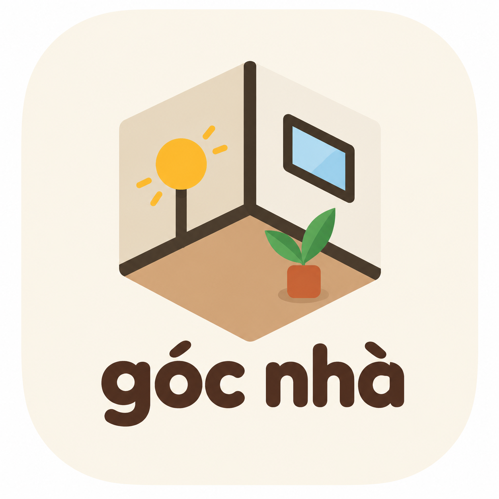

<p align="center">
  
</p>

<h1 align="center">Góc Nhà</h1>

<p align="center">
  <em>Xếp phòng trước khi mua đồ.</em> Plan your room before you buy furniture.
</p>

<p align="center">
  <a href="https://github.com/Tizun71/Goc-Nha/actions/workflows/ci.yml"></a>
  <a href="LICENSE"></a>
  <a href="CONTRIBUTING.md"></a>
</p>

Góc Nhà ("a corner of home") is a browser-based room planner. Enter your room's length and width in centimetres, place furniture at its real size, and check the layout in 2D or in an isometric 3D view, with daylight for any time of day. Claude can join as a co-designer through the built-in [MCP](https://modelcontextprotocol.io) server.

## Features

- **Real sizes.** The room and every item are in centimetres, on a 10/50/100 cm grid.
- **About 90 procedural items** in 12 catalog sections: beds, storage, tables, seating, lighting, textiles, rugs, plants, wall decor, lifestyle corners, doors and windows, appliances. Each item is drawn from its size, so details reflow when you resize it.
- **Layers.** Rugs lie under furniture, decor stands on what is below it, and ceiling lights hang from the ceiling. Only solid furniture is checked for overlaps.
- **Layout checks.** Snapping to walls and other items, live distances to the walls, and warnings for overlaps, items outside the room and furniture in a door's swing, and missing space in front of wardrobes, drawers and desks.
- **Compass and daylight.** Set which way the room faces. The sun follows a typical Vietnamese sun path and enters only through windows. At night the lamps light the room.
- **Isometric 3D** (three.js) from the same data, viewable from all four corners, with real shadows.
- **Mobile layout** with a bottom sheet and touch quick actions.
- **Undo/redo, auto-save**, JSON import/export, PNG export and share links that carry the whole room.
- **AI co-designer.** Claude Desktop or Claude Code can read and edit the room live. Each batch of AI changes is one undo step.

## Quick start

You need Node.js 22.6 or newer and [pnpm](https://pnpm.io) 10.

```bash
git clone https://github.com/Tizun71/Goc-Nha.git
cd Goc-Nha
pnpm install
pnpm dev        # http://localhost:5173
```

| Command          | What it does                                       |
| ---------------- | -------------------------------------------------- |
| `pnpm dev`       | Start the web app with the AI hub                  |
| `pnpm test`      | Run the unit tests (Vitest)                        |
| `pnpm lint`      | Lint with oxlint                                   |
| `pnpm typecheck` | Type check every package                           |
| `pnpm build`     | Type check and build the web app to `apps/web/dist` |
| `pnpm mcp`       | Start the MCP server by hand (clients usually do this) |

## Repository layout

This is a pnpm monorepo.

| Path                                         | Package               | Contents                                                                                    |
| -------------------------------------------- | --------------------- | ------------------------------------------------------------------------------------------- |
| [`packages/core`](packages/core)             | `@goc-nha/core`       | Framework-free model, geometry, compass and sun, collision and snapping, furniture catalog, room-editing ops. All unit tests live here. |
| [`packages/mcp-server`](packages/mcp-server) | `@goc-nha/mcp-server` | The stdio MCP server that Claude clients start.                                             |
| [`apps/web`](apps/web)                       | `@goc-nha/web`        | React app: Konva 2D editor, three.js isometric view, panels, store, AI bridge, dev hub.     |
| [`docs`](docs)                               |                       | [Architecture](docs/architecture.md), [MCP setup](docs/mcp.md), [adding furniture](docs/adding-furniture.md), [visual design](docs/design.md), [product idea](docs/IDEA.md). |

## Let Claude edit the room

```
Claude Desktop / Claude Code ──stdio──> mcp-server ──WebSocket──> hub in the Vite dev server ──> app in the browser
```

Run `pnpm dev` and open the app. In this folder, Claude Code picks up the server from `.mcp.json`. For Claude Desktop and the list of tools, see [docs/mcp.md](docs/mcp.md).

## Contributing

Bug reports, ideas and pull requests are welcome. Read [CONTRIBUTING.md](CONTRIBUTING.md) first. Everyone in the project follows the [Code of Conduct](CODE_OF_CONDUCT.md). To report a security problem, see [SECURITY.md](SECURITY.md).

## License

Copyright (C) 2026 Tizun71

Góc Nhà is free software: you can redistribute it and/or modify it under the terms of the [GNU Affero General Public License](LICENSE) as published by the Free Software Foundation, either version 3 of the License, or (at your option) any later version.

This program is distributed in the hope that it will be useful, but WITHOUT ANY WARRANTY; without even the implied warranty of MERCHANTABILITY or FITNESS FOR A PARTICULAR PURPOSE. See the GNU Affero General Public License for more details.

If you run a modified version of Góc Nhà as a network service, you must offer its users the source code of your version (AGPL-3.0, section 13).
